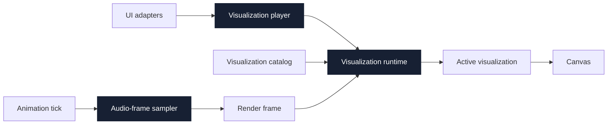
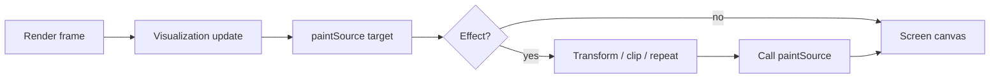
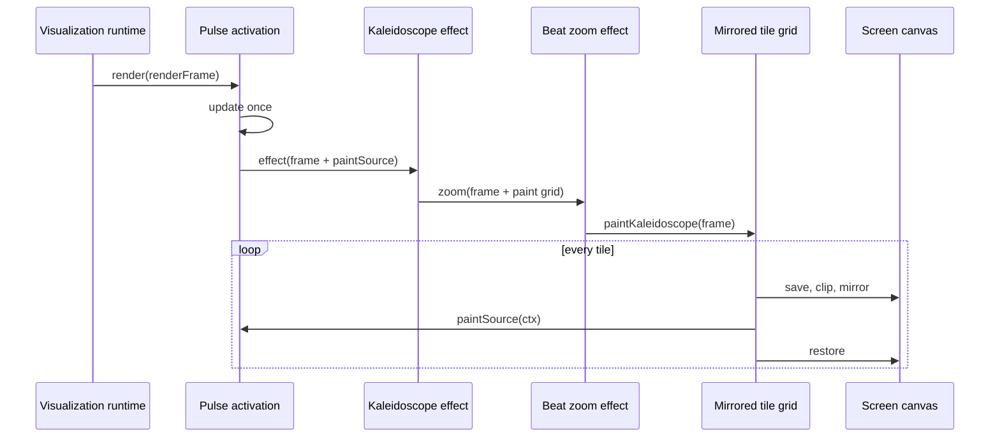
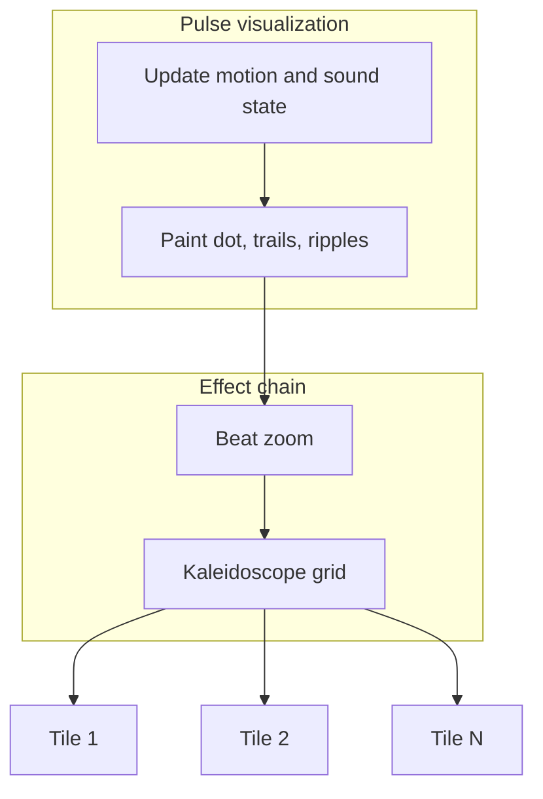
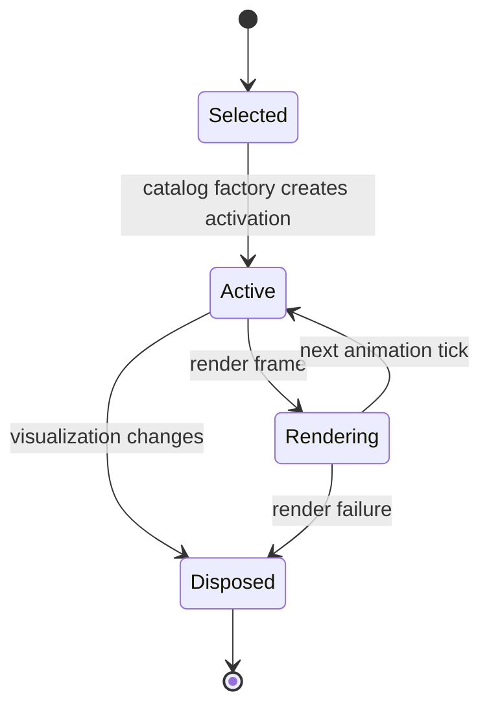
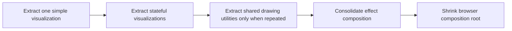

# Effects architecture

This document explains how FATBEATS renders a visualization, how an effect transforms it, and where the architecture stands after the 0.2 refactor.

## Architecture health

The core lifecycle is in good shape. The visualization player owns selection policy, the visualization runtime owns activation lifecycle, the catalog owns registration, and one audio frame is shared by every visualization rendered during an animation tick.

The remaining refactor is mostly migration work: eight visualization implementations, their activation state, and three temporary activation adapters still live in `src/main.js`. Prism is now the completed tracer bullet; the remaining visualizations can follow its activation-scoped pattern without changing the runtime interface.



## The effect idea

A visualization owns state and produces pixels. An effect receives the same render frame plus a `paintSource(target)` callback. The effect changes the canvas transform, clipping, repetition, or compositing, then asks the visualization to paint through that transformed canvas.



The key inversion is that the effect does not need to understand the visualization. It only controls **where and how often** `paintSource` draws.

## Standalone visualization

Pulse without an effect paints directly into the screen canvas.

```mermaid
sequenceDiagram
  participant Loop as Animation tick
  participant Runtime as Visualization runtime
  participant Pulse as Pulse activation
  participant Canvas as Screen canvas
  Loop->>Runtime: render(renderFrame)
  Runtime->>Pulse: render(renderFrame)
  Pulse->>Pulse: update position, trails, echoes
  Pulse->>Canvas: paintSource(ctx)
```

## Pulse with Kaleidoscope

Kaleidoscope reuses Pulse as its visual source. Pulse updates once, creates one `paintSource` callback, and hands it to the Kaleidoscope effect. Kaleidoscope first applies beat zoom, then clips and mirrors a grid of tiles. Every tile calls the same source painter.





This is efficient in state terms: the source updates once per frame. Painting is repeated per tile, which is the intended cost of Kaleidoscope.

## Current composition styles

| User-facing visualization | Source | Effect composition |
| --- | --- | --- |
| Pulse | Pulse module | Direct paint |
| Kaleidoscope | Pulse module | Effect injected into source; beat zoom wraps mirrored grid |
| Glyph | Legacy activation | Activation wrapped by beat zoom |
| Overlap | Legacy activation | Activation wrapped by beat zoom |

There are currently two effect interfaces: source-level injection for Kaleidoscope and activation-level wrapping for Glyph and Overlap. They work, but maintainers must understand both.

## Lifecycle rules



- Visualization state belongs to an activation.
- An effect with state is created inside the catalog factory, so its state also belongs to that activation.
- Canvas transforms must use `save()` and `restore()` so an effect cannot leak drawing state.
- The listening session survives visualization changes.
- Effects do not sample audio; they consume the shared audio frame.

> **Contract mismatch:** `CONTEXT.md` currently says effects render through capped, activation-scoped offscreen buffers. Beat Zoom and Kaleidoscope actually transform and repaint directly on the screen canvas. The implementation should adopt the documented surface model, or an ADR should explicitly revise that contract.

## Remaining refactor candidates

### 1. Extract legacy visualizations — Strong

Move Orbit, Terrain, Overlap, Universe, Tangle, Tunnel, Equalizer, and Glyph out of `src/main.js` into activation-scoped visualization modules. Prism has already moved. This gives visual state locality and lets tests exercise the same interface used by the runtime.

### 2. Consolidate effect composition — Worth exploring

Choose one internal effect-composition style after the legacy visualizations are extracted. Today, source injection and activation wrapping expose two ways to achieve the same idea. Consolidation would increase leverage and reduce caller knowledge, but should follow extraction rather than precede it.

### 3. Extract the browser composition root — Worth exploring

Settings persistence, DOM projection, microphone/camera coordination, analytics, resize, and animation scheduling still share `src/main.js`. Move them only after visualization extraction reveals the smallest useful interfaces; premature seams here would be hypothetical.

### 4. Deepen settings and media lifecycle — Worth exploring

Settings parsing, defaults, clamping, persistence, DOM projection, audio teardown, and temporary camera acquisition remain spread through the composition root. Extract these only at real seams: storage versus DOM adapters for settings, and microphone versus camera adapters for media.

### 5. Keep the runtime and player interfaces — No refactor needed

These modules are already deep: small interfaces hide lifecycle, serialization, recovery, eligibility, and carousel behavior. Deleting either would spread complexity back across the composition root.

## Recommended sequence



Start with Prism or Orbit as a tracer bullet. Keep every extraction behavior-preserving, activation-scoped, and independently testable through `render`, optional `resize`, and `dispose`.
